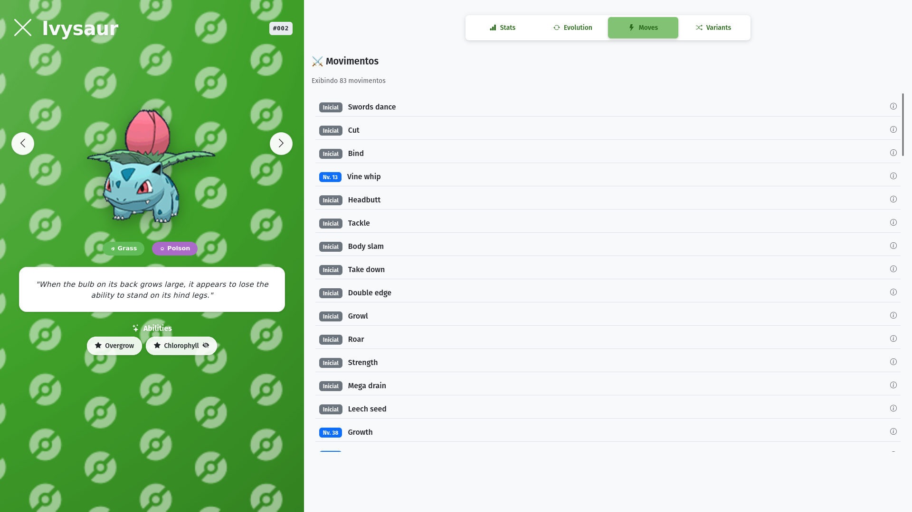
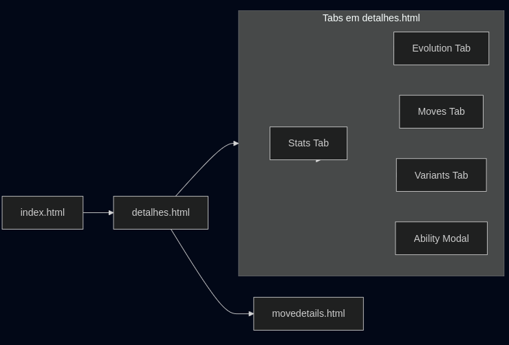
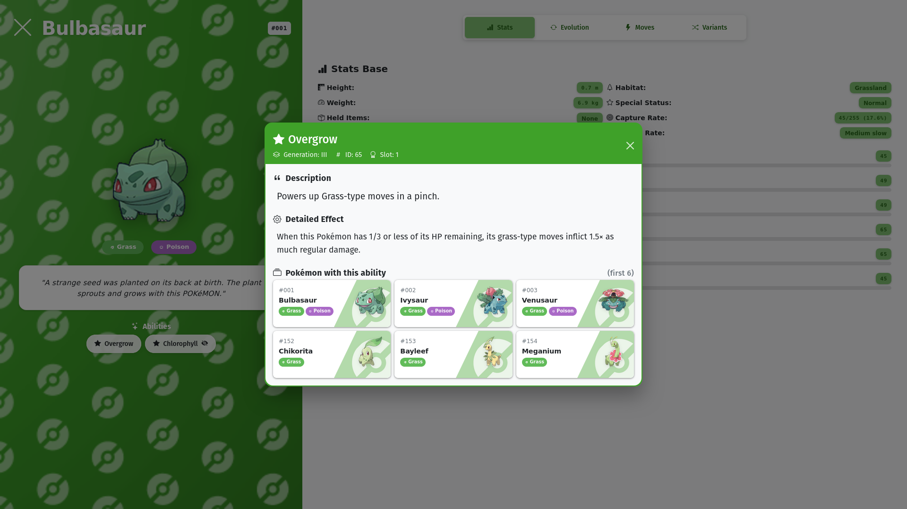
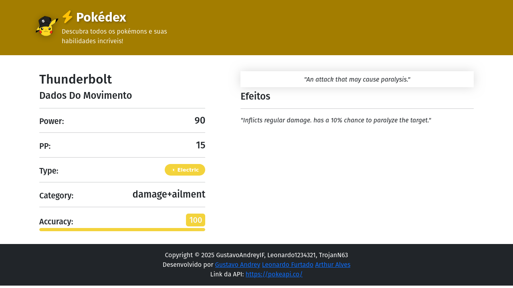
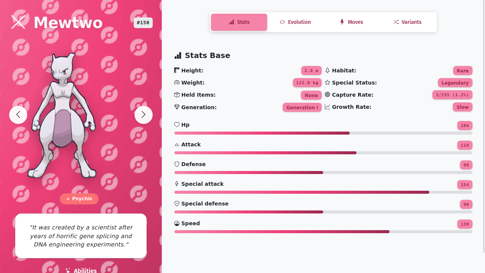
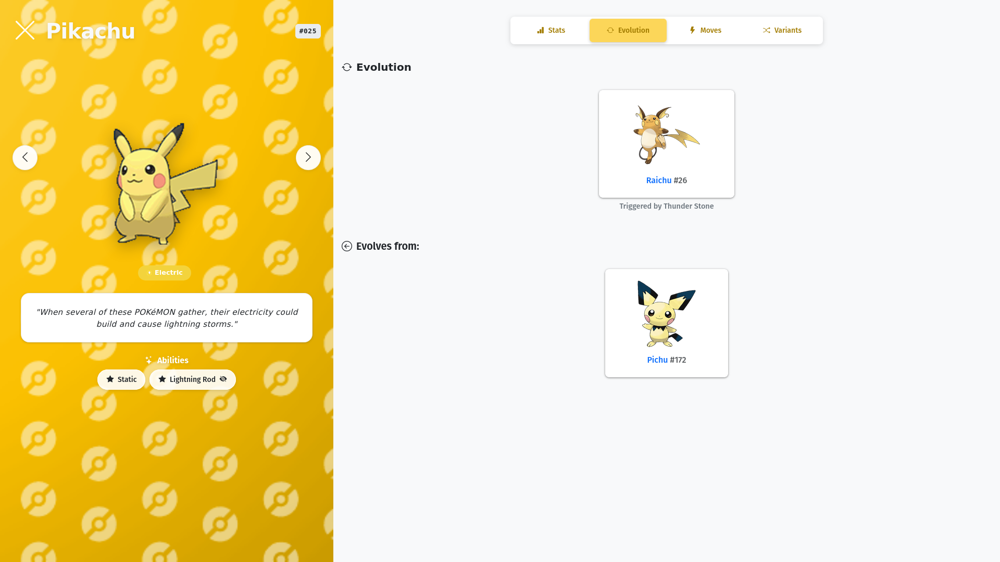

<h1 align="center">Pokédex</h1>

<div align="center">

<a href="https://opensource.org/license/mit"></a>

</div>

⚡ Aplicação web front-end desenvolvida com a PokeApi para a disciplina de Autoria Web do 3º ano do Ensino Médio Técnico em Informática (turma da manhã), com o objetivo de aplicar os conhecimentos adquiridos em Bootstrap.

<h2 align="center">App Preview</h2>
📃 Confira abaixo algumas das principais telas e recursos visuais presentes em nossa aplicação:

<br>

|            |  |
| :-----------------------------------------------------------: | :-------------------------------------------------------: |
|  |      |

<h2 align="center">PokeAPI</h2>
<div align="center">


<br>

<a href="https://pokeapi.co/" style="margin-top: 8px;">
  
</a>
</div>

<br>

💾 Esta aplicação consome a API RESTful da [**PokeAPI**](https://pokeapi.co/) para buscar dados de Pokémon. A PokeAPI fornece objetos detalhados que facilitam a construção de aplicações temáticas de pokémon, especialmente Pokédex.

<br>

<h2 align="center">Paginas</h2>
📺 Diagrama ilustrando o fluxo de navegação entre as principais páginas do projeto:

<br>

<div align="center">
  
</div>

<h3 align="center">DetailsHeader</h3>

🟡 Componente responsável por exibir o cabeçalho de detalhes do Pokémon, incluindo nome, ID, tipo, sprite animado, flavor text e botões de navegação. Também exibe as habilidades com modais explicativos.


<br>

<div align="center">
  
</div>

<br>

```html
<div
	class="text-white py-3 py-md-4 pokemon-header-container"
	style="background-image: url('src/assets/images/gifs/electric.gif');"
>
	<div class="container-fluid px-3 px-md-4">
		<div class="row align-items-center mb-3 mb-md-4">
			<div class="col">
				<div class="d-flex justify-content-between align-items-center">
					<div class="d-flex align-items-center">
						<a
							class="pokemon-back-button back-electric me-2 me-md-3 btn p-0 border-0 bg-transparent"
							href="index.html"
							title="Back to Home"
						>
							<i class="bi bi-x-lg"></i>
						</a>
						<h1 class="pokemon-name-title mb-0">Pikachu</h1>
					</div>
					<small
						class="badge pokemon-id-badge pokedex-number-details pokemon-type-electric fw-bold"
						>#025</small
					>
				</div>
			</div>
		</div>
		<div class="text-center mb-3 mb-md-4">
			<div
				class="position-relative d-flex align-items-center justify-content-center"
			>
				<button
					class="btn pokemon-nav-button pokemon-nav-button--previous nav-electric position-absolute start-0 rounded-circle d-flex align-items-center justify-content-center shadow-sm"
					title="Previous Pokémon (#24)"
					aria-label="Previous Pokémon"
				>
					<i class="pokemon-nav-icon bi bi-chevron-left"></i>
				</button>
				<div class="position-relative d-inline-block">
					<div
						id="audio-indicator"
						class="pokemon-audio-indicator audio-electric position-absolute top-0 end-0 rounded-circle d-flex align-items-center justify-content-center shadow-lg"
					>
						<i
							id="audio-icon"
							class="pokemon-audio-icon audio-electric bi bi-volume-up-fill"
						></i>
					</div>
					
				</div>
				<button
					class="btn pokemon-nav-button pokemon-nav-button--next nav-electric position-absolute end-0 rounded-circle d-flex align-items-center justify-content-center shadow-sm"
					title="Next Pokémon (#26)"
					aria-label="Next Pokémon"
				>
					<i class="pokemon-nav-icon bi bi-chevron-right"></i>
				</button>
			</div>
		</div>
		<div class="text-center mb-3 mb-md-4">
			<div class="d-flex justify-content-center gap-1 gap-md-2 flex-wrap">
				<span
					class="badge text-white pokemon-type-badge px-2 px-md-3 py-2 rounded-pill me-1 me-md-2 d-flex align-items-center"
					style="background-color: #F8D030;"
				>
					
					Electric
				</span>
			</div>
		</div>
		<div class="text-center mb-3 mb-md-4 px-2 px-md-3">
			<div class="pokemon-flavor-card flavor-electric">
				<p class="pokemon-flavor-text mb-0">
					"When several of these POKéMON gather, their electricity could build
					and cause lightning storms."
				</p>
			</div>
		</div>
		<div class="text-center mb-3 mb-md-4 px-2 px-md-3">
			<h6
				class="text-white mb-2 fw-bold"
				style="text-shadow: 0 2px 4px rgba(0, 0, 0, 0.1);"
			>
				<i class="bi bi-stars me-1"></i>
				Abilities
			</h6>
			<div class="d-flex justify-content-center gap-2 flex-wrap">
				<button
					type="button"
					class="btn btn-ability ability-electric"
					data-bs-toggle="modal"
					data-bs-target="#abilityModal-static"
				>
					Static
				</button>
				<button
					type="button"
					class="btn btn-ability ability-electric"
					data-bs-toggle="modal"
					data-bs-target="#abilityModal-lightning-rod"
				>
					Lightning Rod
				</button>
			</div>
		</div>
	</div>
</div>
<div
	class="modal fade"
	id="abilityModal-static"
	tabindex="-1"
	aria-labelledby="abilityModalLabel-static"
	aria-hidden="true"
>
	<div class="modal-dialog">
		<div class="modal-content">
			<div class="modal-header">
				<h5 class="modal-title" id="abilityModalLabel-static">Static</h5>
				<button
					type="button"
					class="btn-close"
					data-bs-dismiss="modal"
					aria-label="Close"
				></button>
			</div>
			<div class="modal-body">Contact with the Pokémon may cause paralysis.</div>
		</div>
	</div>
</div>
<div
	class="modal fade"
	id="abilityModal-lightning-rod"
	tabindex="-1"
	aria-labelledby="abilityModalLabel-lightning-rod"
	aria-hidden="true"
>
	<div class="modal-dialog">
		<div class="modal-content">
			<div class="modal-header">
				<h5 class="modal-title" id="abilityModalLabel-lightning-rod">
					Lightning Rod
				</h5>
				<button
					type="button"
					class="btn-close"
					data-bs-dismiss="modal"
					aria-label="Close"
				></button>
			</div>
			<div class="modal-body">
				Draws in all Electric-type moves to up its Special Attack stat.
			</div>
		</div>
	</div>
</div>
<br />
```

> [!NOTE] > **Comentários do Dev**
>
> "A pagina na qual foi investida mais tempo do projeto, fazer o details principalmente seu header foi trabalhoso não so pelo seu aspecto estatico mas tambem o seu dinamico, cada pokemon possue uma cor, um fundo, um sprite animado, sem contar os modais detalhas que reage a todas essas variaveis tambem, fora os tooltips, botões, hover, e os demais efeitos como o de audio ao clicar no pokemon."
>
> — [GustavoAndreyIF](https://github.com/GustavoAndreyIF)

<h3 align="center">Move Details</h3>
⚡ Componente responsável por exibir os detalhes completos de um movimento (golpe) do Pokémon, incluindo atributos, efeitos e descrição visual.

<br>

<div align="center">
  
</div>

<br>

```html
<div id="move-main-container">
	<div class="d-md-flex container mt-3">
		<div class="card border-0 mb-3 move-details-card">
			<div class="card-body">
				<h2 class="text-capitalize">Thunderbolt</h2>
				<h4 class="text-capitalize">Dados do Movimento</h4>
				<hr />
				<div class="d-flex align-items-end justify-content-between mb-3">
					<div><h5 class="card-text">Power:</h5></div>
					<h4 class="card-text">90</h4>
				</div>
				<hr />
				<div class="d-flex align-items-end justify-content-between mb-3">
					<div><h5 class="card-text">PP:</h5></div>
					<h4 class="card-text">15</h4>
				</div>
				<hr />
				<div class="d-flex align-items-end justify-content-between mb-3">
					<div><h5 class="card-text">Type:</h5></div>
					<span
						class="badge text-white pokemon-type-badge px-2 px-md-3 py-2 rounded-pill d-flex align-items-center"
						style="background-color: #F8D030;"
					>
						
						Electric
					</span>
				</div>
				<hr />
				<div class="d-flex align-items-end justify-content-between mb-3">
					<div><h5 class="card-text">Category:</h5></div>
					<h4 class="card-text">special</h4>
				</div>
				<hr />
				<div class="d-flex align-items-end justify-content-between mb-1">
					<div><h5 class="card-text">Accuracy:</h5></div>
					<h5
						class="card-text px-2 py-1 rounded text-light"
						style="background-color: #F8D030"
					>
						100
					</h5>
				</div>
				<div
					class="progress stats-progress"
					style="height: 8px; border-radius: 4px;"
				>
					<div
						class="progress-bar stats-progress-bar stats-progress-bar--electric"
						style="width: 100%; background-color: #F8D030;"
					></div>
				</div>
			</div>
		</div>
		<div class="card border-0 mb-3 move-details-card-2">
			<div class="card-body">
				<div class="flavor-move-text p-2 mb-5 mb-md-2 text-center">
					<p class="card-text">
						<i>"Um ataque elétrico poderoso que pode paralisar o alvo."</i>
					</p>
				</div>
				<h4 class="card-text">Efeitos</h4>
				<hr />
				<p class="card-text"><i>"Pode paralisar o oponente."</i></p>
			</div>
		</div>
	</div>
</div>
```

> [!NOTE] > **Comentários do Dev**
>
> "Fazer o moveDetails em si não foi complicado, obviamente já que eu utilizei o auxílio do Copilot, mas a problemática era no geral, integrar a página à todo resto do site o que seria bem trabalhoso. O detalhe de um movimento é referenciado na TAB de movimentos que um pokemon pode aprender, devido a arquitetura REST da api utilizada, isso foi bem tranquilo de fazer. Feito isso, a segunda parte foi montar os componentes dinamicamente, o moveDetailsHeader é uma reciclagem do header da Home, porém utiliza do Type do move referenciado para alterar a cor dinâmicamente, cada paleta de cores foi salva em variáveis CSS que foram então foram exportadas. Por fim, o moveDetailMain contém os detalhes mais essenciais dos movimentos, como PP, Poder, precisão e etc, apenas incluindo um flavor text e o efeito do movimento, todos carregados dinamicamente."
>
> — [Leonardo1234321](https://github.com/Leonardo1234321)

<h2 align="center">Sessões dos detalhes dos Pokemons</h2>
🧱 Conheça os principais componentes reutilizáveis da nossa aplicação, apresentados com exemplos de HTML simples e prático.

<h3 align="center">Stats Tab</h3>
📊 Componente responsável por exibir as estatísticas base do Pokémon de forma visual, incluindo barras de progresso, altura, peso, geração, habitat e status especial.


<br>

<div align="center">
  
</div>

<br>

```html
<div class="stats-tab stats-tab--psychic">
	<h5 class="fw-semibold mb-3 stats-title">
		<i class="bi bi-bar-chart-fill me-2"></i>Stats Base
	</h5>
	<div class="stats-info mb-3">
		<div class="row g-2">
			<div class="col-md-6">
				<div class="d-flex justify-content-between align-items-center mb-2">
					<small class="fw-bold stats-text"
						><i class="bi bi-rulers"></i> Height:</small
					>
					<span class="badge stat-badge stat-badge--psychic stats-number"
						>2.0 m</span
					>
				</div>
				<div class="d-flex justify-content-between align-items-center mb-2">
					<small class="fw-bold stats-text"
						><i class="bi bi-speedometer2"></i> Weight:</small
					>
					<span class="badge stat-badge stat-badge--psychic stats-number"
						>122.0 kg</span
					>
				</div>
				<div class="d-flex justify-content-between align-items-center mb-2">
					<small class="fw-bold stats-text"
						><i class="bi bi-box-seam"></i> Held Items:</small
					>
					<div>
						<span class="badge stat-badge stat-badge--psychic stats-text"
							>None</span
						>
					</div>
				</div>
				<div class="d-flex justify-content-between align-items-center mb-2">
					<small class="fw-bold stats-text"
						><i class="bi bi-gem"></i> Generation:</small
					>
					<span class="badge stat-badge stat-badge--psychic stats-text"
						>Generation I</span
					>
				</div>
			</div>
			<div class="col-md-6">
				<div class="d-flex justify-content-between align-items-center mb-2">
					<small class="fw-bold stats-text"
						><i class="bi bi-tree"></i> Habitat:</small
					>
					<span class="badge stat-badge stat-badge--psychic stats-text"
						>Rare</span
					>
				</div>
				<div class="d-flex justify-content-between align-items-center mb-2">
					<small class="fw-bold stats-text"
						><i class="bi bi-star"></i> Special Status:</small
					>
					<span class="badge stat-badge stat-badge--psychic stats-text"
						>Legendary</span
					>
				</div>
				<div class="d-flex justify-content-between align-items-center mb-2">
					<small class="fw-bold stats-text"
						><i class="bi bi-bullseye"></i> Capture Rate:</small
					>
					<span class="badge stat-badge stat-badge--psychic stats-number"
						>3/255 (1.2%)</span
					>
				</div>
				<div class="d-flex justify-content-between align-items-center">
					<small class="fw-bold stats-text"
						><i class="bi bi-graph-up"></i> Growth Rate:</small
					>
					<span class="badge stat-badge stat-badge--psychic stats-text"
						>Slow</span
					>
				</div>
			</div>
		</div>
	</div>
	<div class="stats-container mt-3">
		<div class="mb-3">
			<div class="d-flex justify-content-between mb-1">
				<small class="fw-bold stats-text"><i class="bi bi-heart"></i> HP</small>
				<small class="badge stat-badge stat-badge--psychic stats-number"
					>106</small
				>
			</div>
			<div
				class="progress stats-progress"
				style="height: 8px; border-radius: 4px;"
			>
				<div
					class="progress-bar stats-progress-bar stats-progress-bar--psychic"
					style="width: 58.9%;"
				></div>
			</div>
		</div>
		<div class="mb-3">
			<div class="d-flex justify-content-between mb-1">
				<small class="fw-bold stats-text"
					><i class="bi bi-caret-up"></i> Attack</small
				>
				<small class="badge stat-badge stat-badge--psychic stats-number"
					>110</small
				>
			</div>
			<div
				class="progress stats-progress"
				style="height: 8px; border-radius: 4px;"
			>
				<div
					class="progress-bar stats-progress-bar stats-progress-bar--psychic"
					style="width: 61.1%;"
				></div>
			</div>
		</div>
		<div class="mb-3">
			<div class="d-flex justify-content-between mb-1">
				<small class="fw-bold stats-text"
					><i class="bi bi-shield"></i> Defense</small
				>
				<small class="badge stat-badge stat-badge--psychic stats-number"
					>90</small
				>
			</div>
			<div
				class="progress stats-progress"
				style="height: 8px; border-radius: 4px;"
			>
				<div
					class="progress-bar stats-progress-bar stats-progress-bar--psychic"
					style="width: 50.0%;"
				></div>
			</div>
		</div>
		<div class="mb-3">
			<div class="d-flex justify-content-between mb-1">
				<small class="fw-bold stats-text"
					><i class="bi bi-lightning"></i> Special Attack</small
				>
				<small class="badge stat-badge stat-badge--psychic stats-number"
					>154</small
				>
			</div>
			<div
				class="progress stats-progress"
				style="height: 8px; border-radius: 4px;"
			>
				<div
					class="progress-bar stats-progress-bar stats-progress-bar--psychic"
					style="width: 85.6%;"
				></div>
			</div>
		</div>
		<div class="mb-3">
			<div class="d-flex justify-content-between mb-1">
				<small class="fw-bold stats-text"
					><i class="bi bi-shield-check"></i> Special Defense</small
				>
				<small class="badge stat-badge stat-badge--psychic stats-number"
					>90</small
				>
			</div>
			<div
				class="progress stats-progress"
				style="height: 8px; border-radius: 4px;"
			>
				<div
					class="progress-bar stats-progress-bar stats-progress-bar--psychic"
					style="width: 50.0%;"
				></div>
			</div>
		</div>
		<div class="mb-3">
			<div class="d-flex justify-content-between mb-1">
				<small class="fw-bold stats-text"
					><i class="bi bi-speedometer"></i> Speed</small
				>
				<small class="badge stat-badge stat-badge--psychic stats-number"
					>130</small
				>
			</div>
			<div
				class="progress stats-progress"
				style="height: 8px; border-radius: 4px;"
			>
				<div
					class="progress-bar stats-progress-bar stats-progress-bar--psychic"
					style="width: 72.2%;"
				></div>
			</div>
		</div>
	</div>
</div>
```

> [!NOTE] > **Comentários do Dev**
>
> "Facilmente uma das partes mais legais de se explorar dentro da api do pokeapi, eu fiz algumas varias varições de como exibir essa sessão no html, brincar com as colunar e usar o componente de progress bar do bootstrap foi uma experiencia gratificante, mesmo desenhando diferente layout para a pagina, o escolhido foi quase como uma fusão de todos eles."
>
> — [GustavoAndreyIF](https://github.com/GustavoAndreyIF)

<h3 align="center">Evolution Tab</h3>

🔁 Componente responsável por exibir a cadeia evolutiva do Pokémon de forma visual e interativa, permitindo navegar entre as diferentes formas evoluídas e pré-evoluídas.

<br>

<div align="center">
  
</div>

<br>

```html
<h5 class="fw-semibold mb-3 stats-title">
	<i class="bi bi-arrow-repeat me-2"></i>Evolution
</h5>
<div class="row justify-content-center">
	<div class="col-12 col-md-4 d-flex justify-content-center mb-4">
		<a
			href="detalhes.html?id=26"
			class="text-decoration-none w-100"
			style="max-width: 260px; padding-top: 1rem;"
		>
			<div class="pokemon-card text-center p-3">
				
				<h6 class="mt-2">Raichu <span class="text-muted">#26</span></h6>
			</div>
			<h6 class="mt-2 text-center" style="font-size: 0.9rem; color: #6c757d;">
				Triggered by Thunder Stone
			</h6>
		</a>
	</div>

	<h5 class="fw-semibold mb-3 mt-4">
		<i class="bi bi-arrow-left-circle me-2"></i>Evolves from:
	</h5>

	<div>
		<a
			href="detalhes.html?id=$172"
			class="text-decoration-none w-100"
			style="max-width: 260px; padding-top: 1rem;"
		>
			<div class="pokemon-card text-center p-3">
				
				<h6 class="mt-2">Pichu <span class="text-muted">#172</span></h6>
			</div>
		</a>
	</div>
</div>
```

> [!NOTE] > **Comentários do Dev**
>
> "Primeiro, decidi como organizar as possível evoluções, escolhi estruturar em cards que podem te levar à página de detalhes da evolução. O código usa o id do pokémon que vemos para acessar sua api e procurar a chave 'evolution_chain' e sua url. A partir da cadeia evolutiva, determinei onde está o pokémon atual para listar os próximos e o anterior, caso o pokémon em si seja uma evolução. A parte mais interessante do código é o looping de acessar a chave 'evolves_to' e comparar o nome da espécie para saber em que estágio estamos."
>
> — [TrojanN63](https://github.com/TrojanN63)

<h2 align="center">Contribuição</h2>
👥 Esse projeto não seria possível sem os seguintes amigos feitos pelo caminho <3

<br>


<div align="center">

| <a href="https://github.com/GustavoAndreyIF"><br><b>GustavoAndreyIF</b></a> | <a href="https://github.com/TrojanN63"><br><b>TrojanN63</b></a> | <a href="https://github.com/Leonardo1234321"><br><b>Leonardo1234321</b></a> |
| :----------------------------------------------------------------------------------------------------------------------------------------------------------------: | :----------------------------------------------------------------------------------------------------------------------------------------------: | :----------------------------------------------------------------------------------------------------------------------------------------------------------------: |

</div>

<h3 align="center">Comentarios dos Devs</h3>

> [!NOTE] > **Comentários do Dev**
>
> "Esse entra em um dos trabalhos mais divertidos e malucos que eu fiz desde o ultimo trabalho na disciplina de PEOO do semestre passado do curso, evoluir minhas habilidades no front usando apenas JS foi um dificil, mas considero o resultado gratificante pois apesar de ser feito nos meus dias livres nos fins de semana, consegui entregar um trabalho incrivel com os meus amigos dentro do scope que era o trabalho pedido pelo nosso professor."
>
> — [GustavoAndreyIF](https://github.com/GustavoAndreyIF)

> [!NOTE] > **Comentários do Dev**
>
> "Fora a aba de evoluções, fiz a de variantes —a princípio, funciona igual— e alguns detalhes de decoração: separar os icons de cada tipo e fazer o gif de background que originalmente era uma imagem parada, mas com o uso da linguagem python e das bibliotecas opencv e pillow, salvei várias versões cortadas da imagem em partes diferentes e salvei na forma de gif, aparentando a movimentação."
>
> — [TrojanN63](https://github.com/TrojanN63)
