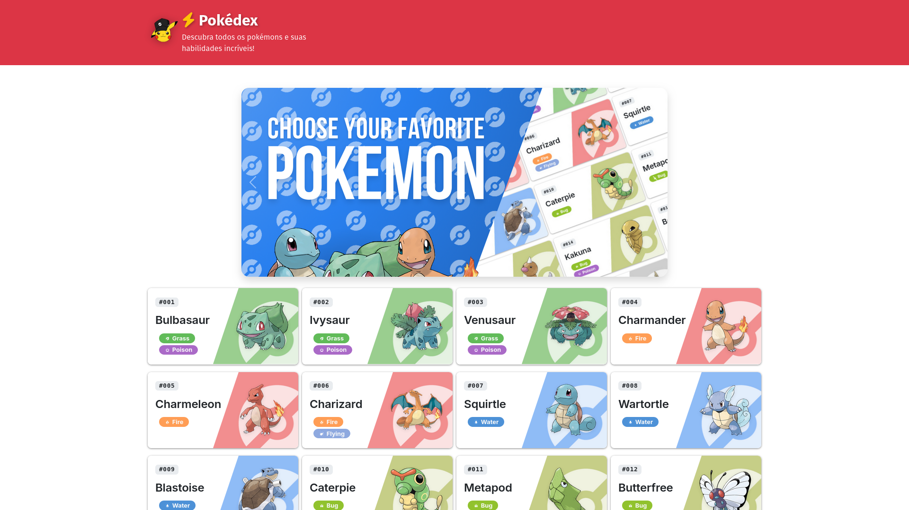
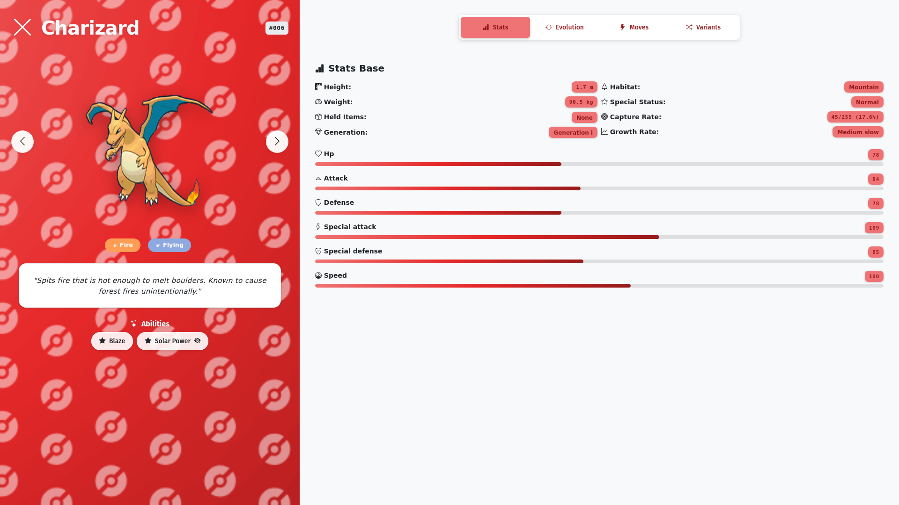
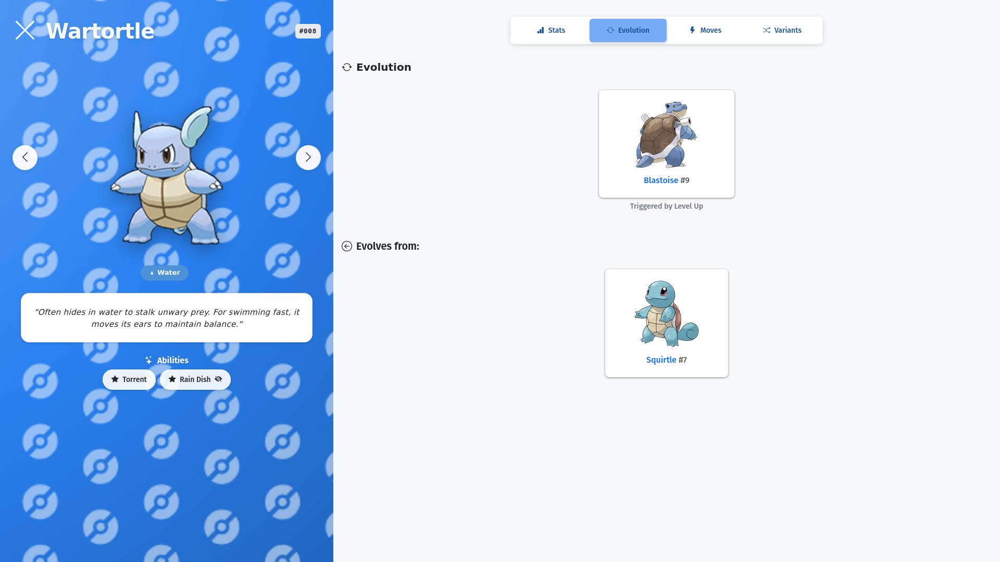
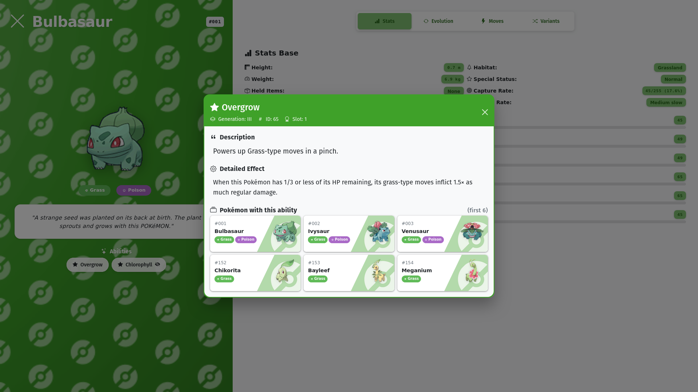

<h1 align="center">Pokédex</h1>

⚡ Aplicação web front-end desenvolvida com a PokeApi para a disciplina de Autoria Web do 3º ano do Ensino Médio Técnico em Informática (turma da manhã), com o objetivo de aplicar os conhecimentos adquiridos em Bootstrap.

<h2 align="center">App Preview</h2>

|            |  |
| :-----------------------------------------------------------: | :-------------------------------------------------------: |
|  |      |

<h2 align="center">PokeAPI</h2>

💾 Esta aplicação consome a API RESTful da [**PokeAPI**](https://pokeapi.co/) para buscar dados de Pokémon. A PokeAPI fornece objetos detalhados que facilitam a construção de aplicações temáticas de pokémon, especialmente Pokédex.

<h2 align="center">Contribuição</h2>
👥 Esse projeto não seria possível sem os seguintes amigos feitos pelo caminho <3

|  |  |  |
| :-----------------------------------------------------------------------------------------------------: | :------------------------------------------------------------------------------------: | :------------------------------------------------------------------------------------------------------: |
|                        [**GustavoAndreyIF**](https://github.com/GustavoAndreyIF)                        |                     [**TrojanN63**](https://github.com/TrojanN63)                      |                        [**Leonardo1234321**](https://github.com/Leonardo1234321)                         |
